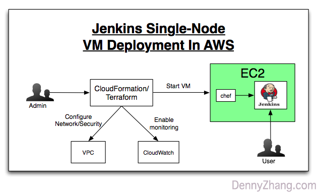
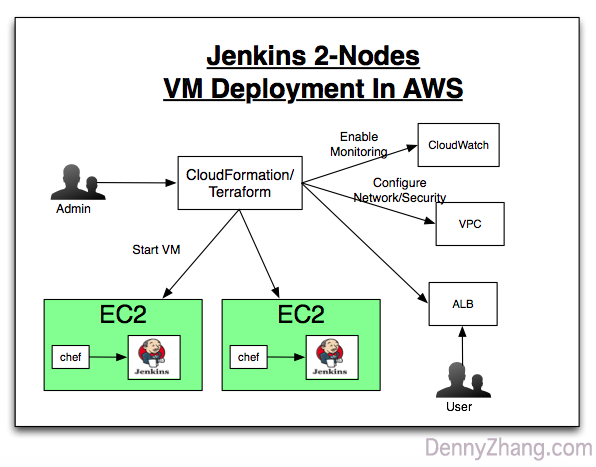
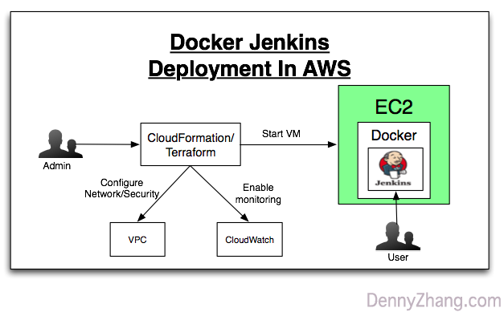
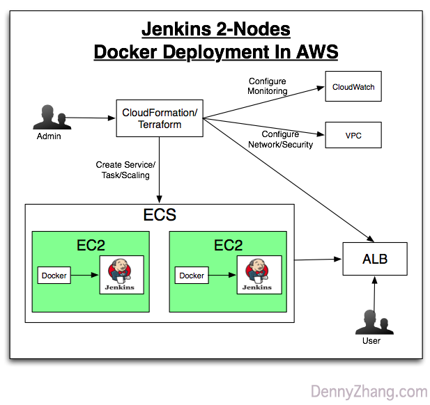

# aws-jenkins-study

 

  

File me [tickets](https://github.com/DennyZhang/aws-jenkins-study/issues) or star [the repo](https://github.com/DennyZhang/aws-jenkins-study).

Table of Contents
=================

   * [aws-jenkins-study](#aws-jenkins-study)
   * [Requirements](#requirements)
      * [Scenario: VM Single-Node Deployment](#scenario-vm-single-node-deployment)
      * [Scenario: VM 2-Nodes Deployment](#scenario-vm-2-nodes-deployment)
      * [Scenario: ECS Single-Node Deployment](#scenario-ecs-single-node-deployment)
      * [Scenario: ECS 2-Nodes Deployment](#scenario-ecs-2-nodes-deployment)
   * [Highlights](#highlights)
   * [Follow Up](#follow-up)
   * [More Resources](#more-resources)
   * [License](#license)

Case study using AWS techstack to setup Jenkins env

# Requirements
Setup Jenkins in AWS using cloud formation and your favorite config mgmt tool(Chef/Puppet)
- Use cloud formation start EC2 VM
- Use Chef to deploy Jenkins instance
- Jenkins install sample jobs
- [Optional] Setup ELB/ASG
- [Optional] Security Hardening
- [Optional] Monitoring/Alerting

## Scenario: VM Single-Node Deployment

## Scenario: VM 2-Nodes Deployment

## Scenario: ECS Single-Node Deployment

## Scenario: ECS 2-Nodes Deployment

# Highlights
- **Principle**: 1. Fully automated. 2. Improve availability
- TODO: How to verify deployment quickly: use docker
- TODO: How to verify the Jenkins deployment: use serverspec
- TODO: How to test cluster env: use kitchen converge
- TODO: How to test customization: multiple kitchen

# Follow Up
- TODO: What about backup, and Jenkins two-way sync
- TODO: HA jenkins env

# More Resources
- https://github.com/awslabs/startup-kit-templates
- https://github.com/awslabs

# License
- Code is licensed under [MIT License](https://www.dennyzhang.com/wp-content/mit_license.txt).

